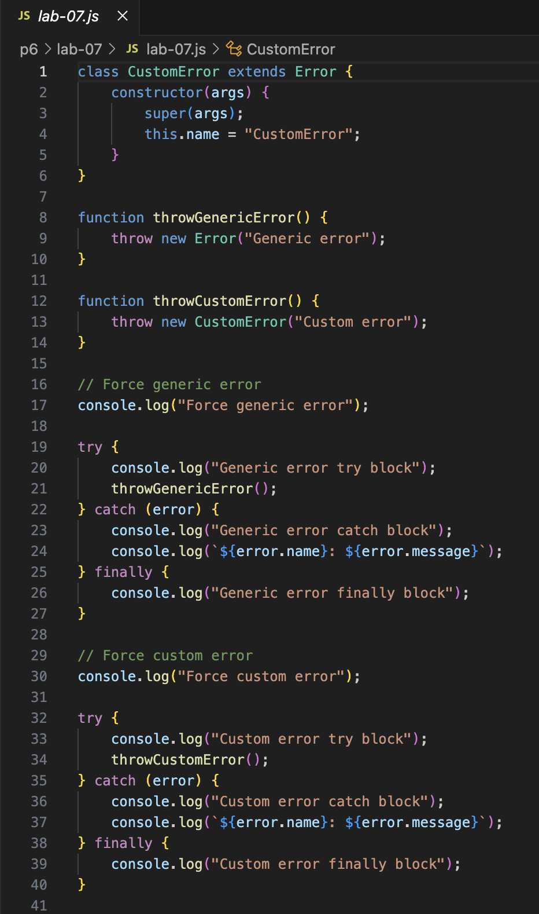
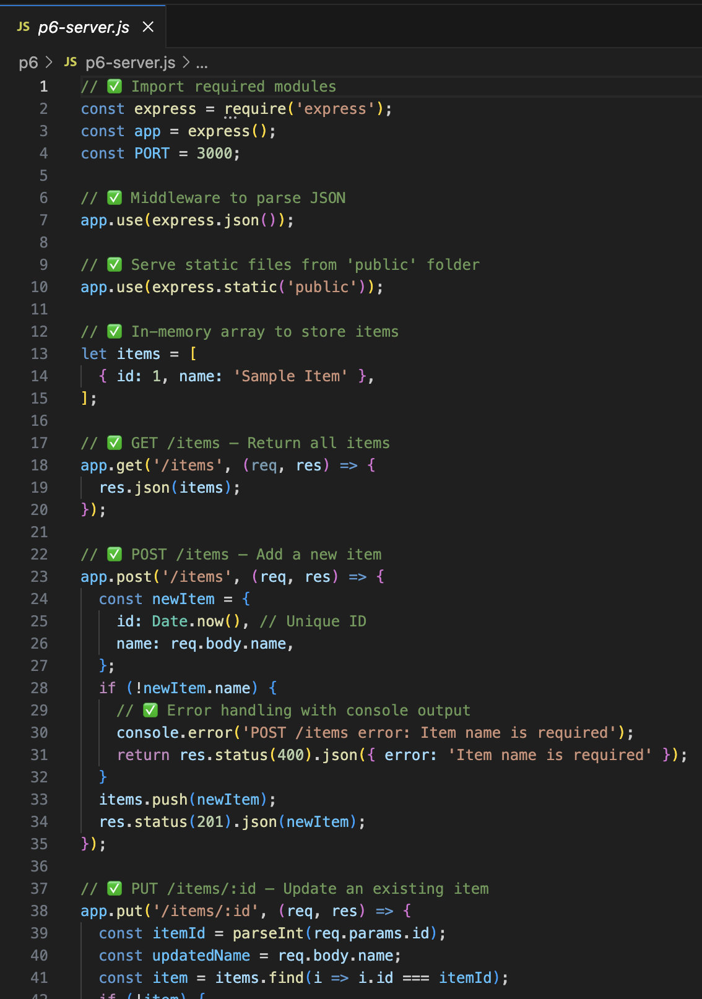

# CIT 281 Project 6

## Lab 7
Goal: Create a GitHub personal website with Pages, set up and clone repos, write Node.js JavaScript files, handle errors, and push changes to GitHub.

## Project 6
Purpose:
The purpose of this project was to build a full client-server web application using Node.js and Express. The app allows users to interact with a list of items by performing all four main HTTP operations: GET, POST, PUT, and DELETE. It was designed to give hands-on experience working with server routes, APIs, error handling, and front-end integration.

Technologies:
– Node.js
– Express.js
– HTML / CSS / JavaScript
– Fetch API
– Git & GitHub

Learned:
– How to set up and structure an Express server
– How to create and test RESTful routes for GET, POST, PUT, and DELETE
– How to use fetch() to communicate between client and server
– How to send and receive JSON data between client and server
– How to handle errors gracefully and return proper JSON responses
– How to use Git for version control and GitHub for hosting the code
– How to organize a project with both client and server components

